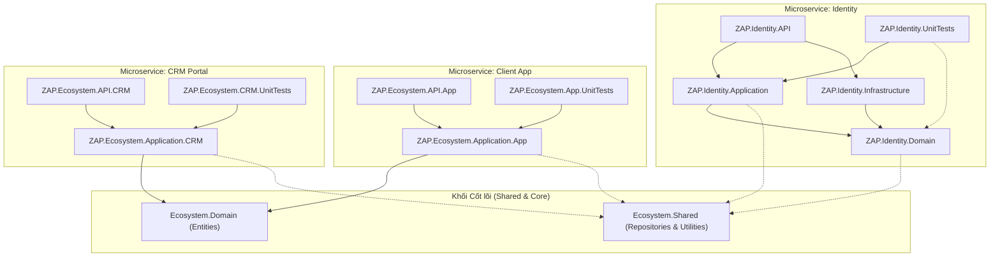
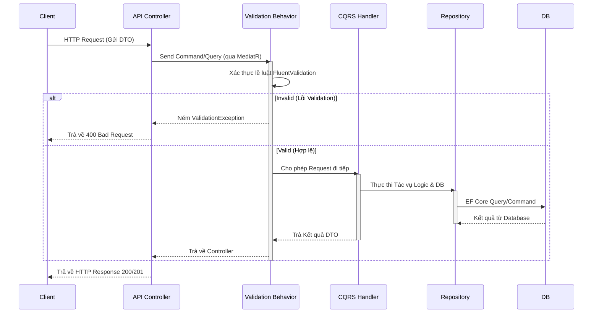

# Kỹ năng (Skill) Lập trình & Tiến trình xử lý (Workflow) Kiến trúc ZAP

Tài liệu này đóng vai trò như một **Skill Set** và **Standard Operating Procedure (SOP)** để AI và các Developer tuân thủ nghiêm ngặt trong mọi phiên làm việc tiếp theo khi phát triển các chức năng mới cho `ZAP.Identity` (cũng như `App` / `CRM` của Hệ sinh thái ZAP).

---

## 🏗️ 1. Sơ đồ Kiến trúc Toàn Hệ thống (Macro Architecture Diagram)

Dưới đây là sơ đồ tổng kết mối quan hệ đa tầng (Clean Architecture) của toàn bộ các Microservices trong ZAP (.slnx), kèm theo lớp Unit Test bảo vệ xung quanh:



---

## 🧩 2. Quy chuẩn Kiến trúc Chi tiết (Architecture Pattern)
Kiến trúc tổng thể áp dụng **Clean Architecture** kết hợp với mô hình **Feature-per-Folder** và **Vertical Slice Architecture** cho lớp Application / API.

### 📌 Nguyên tắc Đặt tên Thư mục (Feature Folder Structuring):
Bất kỳ một cụm chức năng (Feature) nào cũng phải được đặt trong một thư mục đóng gói theo quy tắc **Mảng nghiệp vụ (Group) -> Chức năng (Feature) -> Phiên bản (Version) -> Khối logic (Block)**.
```text
Features/
 └── {FeatureGroup}/              (VD: Customers, Auth, Product)
      └── {FeatureName}/          (VD: Profile, AppAuth, Inventory)
           └── {Version}/         (VD: v1, v2)
                ├── Controllers/  (Ở lớp API)
                ├── Queries/      (Ở lớp Application - GET data)
                └── Commands/     (Ở lớp Application - POST/PUT/DELETE)
```

### 📌 Nguyên tắc Namespace:
- Chữ cái viết hoa PascalCase ở mọi cấp độ: 
  `ZAP.Identity.Application.Features.Customers.Profile.V1.Queries`
- Không sử dụng file `xyz.cs` gộp nhiều pattern. Request, Response DTO và Handler phải phân tách rõ ràng.

---

## 🎯 3. Sơ đồ xử lý Code & Tiến trình mã nguồn (Implementation Code Workflow)

Dưới đây là Sơ đồ Trình tự (Sequence Diagram) chuẩn hóa quy định đường đi của một HTTP Request khi tiến hành xử lý qua các tầng của hệ thống ZAP:



Khi có yêu cầu thêm một "Chức năng mới" (ví dụ: Thay đổi mật khẩu khách hàng), tuyệt đối phải tuân thủ thứ tự làm việc (Thứ tự xử lý) theo đúng 8 Bước sau từ trong lõi ra ngoài:

### Bước 1: Xử lý Tầng Lõi (Domain & Infrastructure)
- **Hành động**: Xác định Entitty tương ứng. Nếu cần thêm cột, tiến hành mở rộng tại `ZAP.Identity.Domain\Entities\TênBảng.cs`.
- **Lưu ý**: Các thuộc tính phải được gán Annotation đầy đủ `[Column("...")]`, `[MaxLength]`.

### Bước 2: Thiết kế DTO & Contract (Tầng Application)
- **Hành động**: Tạo file DTO Response và file/record Query/Command.
- **Thư mục mẫu**: `Application\Features\{Group}\{Feature}\v1\Commands\ChangePasswordCommand.cs`.

### Bước 3: Chặn dữ liệu (Input Validation) bằng FluentValidation (Tầng Application)
- **Hành động bắt buộc**: Phải tạo file `...Validator.cs` kế thừa `AbstractValidator<TRequest>`.
- **Yêu cầu**: Validate DTO (ví dụ NotEmpty, MinimumLength) diễn ra **TRƯỚC KHI** chạm vào Logic Handler thông qua MediatR Pipeline Behavior. Không được để lọt dữ liệu bẩn xuống Handler.
- **Thư mục mẫu**: `Application/Features/{Group}/{Feature}/v1/Commands/...Validator.cs`.
- **Cấu trúc mẫu**:
  ```csharp
  using MediatR;
  namespace ZAP.Identity.Application.Features.Auth.Account.V1.Commands;
  
  public class ChangePasswordResponse { 
      public bool IsSuccess { get; set; } 
  }
  
  public class ChangePasswordCommand : IRequest<ChangePasswordResponse> {
      public Guid CustomerId { get; set; }
      public string NewPassword { get; set; }
  }
  ```

### Bước 4: Triển khai Logic Nghiệp vụ CQRS (Tầng Application)
- **Hành động**: Tạo Handler xử lý `IRequestHandler<TRequest, TResponse>`.
- **Thư mục mẫu**: Cùng nằm bên cạnh file Command/Query.
- **Quy tắc bảo vệ**: Luôn tiêm (Inject) thông qua `IBaseRepository<T>` và viết logic xử lý ở đây. Handler không được trả ra Exception rác mà phải ném lỗi cụ thể (ví dụ UnauthorizedAccessException, Exception logic) hoặc bọc kết quả trong cấu trúc chuẩn của hệ thống.

### Bước 5: Tạo Endpoints đàm phán HTTP (Tầng API)
- **Hành động**: Cấu hình Controller kế thừa `BaseApiController`.
- **Thư mục mẫu**: `API\Features\{Group}\{Feature}\v1\Controllers\{Feature}Controller.cs`
- **Quy tắc**:
  1. Yêu cầu có `[Asp.Versioning.ApiVersion("1.0")]`
  2. Route luôn phải là: `[Route("api/v{version:apiVersion}/[tên-group]/[tên-tính-năng]")]`.
  3. Cấm tuyệt đối tiêm (inject) Service hoặc Repository vào Controller. **Chỉ được Inject `IMediator`**.
  4. Nếu thao tác cần ID của tài khoản đang đăng nhập, tự động lấy qua `User.FindFirstValue(ClaimTypes.NameIdentifier)` thay vì bắt người dùng (Client) truyền dồn vào tham số (Params).

### Bước 6: Bổ sung Cơ chế Bảo mật bổ trợ (Tầng API)
- **Hành động**: Endpoint public thì gắn `[AllowAnonymous]`. Endpoint nội bộ gắn `[Authorize]`. Cấu hình quyền (Roles) bằng `[Authorize(Roles="...")]` nếu cần.
- **Verify**: API sau khi bổ sung phải tận dụng được Global Filter, RateLimiter và XSS Middleware có sẵn ở `Program.cs`. 

### Bước 7: Xác thực & Bàn giao (Validation)
- Chạy lệnh Terminal bắt buộc: `dotnet build <đường_dẫn_đến_API_csproj>`
- Trả về mã không sinh Warning hoặc Lỗi tham chiếu `CS0246` / `CS0104`.
- Báo cáo cho người dùng với tài liệu tóm tắt endpoints và cách test.

### Bước 8: Kiểm thử tự động (Unit Testing & TDD Guard)
- **Bắt buộc tuyệt đối**: Mỗi khi thiết lập một Module mới, hoặc chỉnh sửa Module cũ, cấu trúc `ZAP.Identity.UnitTests` phải được cập nhật ngay lập tức.
- **Tiêu chuẩn**: Tạo file Test (dùng xUnit, Moq, FluentAssertions) map đúng 1:1 với thư mục Handler & Validator hiện tại (ví dụ: `Features/Customers/Profile/v1/Queries/...Tests.cs`).
- **Thực thi**: Phải chạy CLI `dotnet test` tự động.
- **Cam kết AI Zero-Bug**: Đảm bảo toàn bộ test case bao phủ 100% tỷ lệ pass cho endpoint. Nếu Failed -> AI tự động điều tra Log, đối chiếu Mock Parameters và sửa lỗi ngay lập tức trước khi report lại cho DEV/Người dùng. AI **CHỈ GIAO CODE (Deliver)** nếu test pass hoàn toàn.

---
## 🚨 LỆNH THÉP DÀNH CHO AI (STRICT EXECUTION PROTOCOL)
1. **Rule 1**: KHÔNG BAO GIỜ bỏ qua Input Validation Behavior trước Logic.
2. **Rule 2**: KHÔNG BAO GIỜ được gửi code cho người dùng nếu chưa có Unit Test cho module vừa code.
3. **Rule 3**: Nếu Unit Test báo `FAIL`, tuyệt đối KHÔNG ĐƯỢC báo cáo "Đã xong", mà phải âm thầm (hoặc báo là đang fix) tìm lỗi, sửa script, build lại và test đến khi `PASS 100%` mới hoàn tất Output cho phiên giao tiếp.

---

## ⚡ 3. Các Tool & Pattern bổ sung
- **Entity Framework & Repository Pattern**: Chỉ thao tác bằng `IBaseRepository<T>`.
- **Microservices**: Toàn bộ Identity không được dính líu trực tiếp code sang App/CRM, chỉ tương tác qua việc Validate chung Secret Key Token, hoặc Message Queue (nếu có sau này).
- **Tránh Xung đột Namespaces**: Khi khai báo `ApiVersion`, phải explicit rõ ràng tránh hiểu nhầm giữa của Mvc cổ hoặc Asp.Versioning mới (Ví dụ: dùng `[Asp.Versioning.ApiVersion("1.0")]`).
